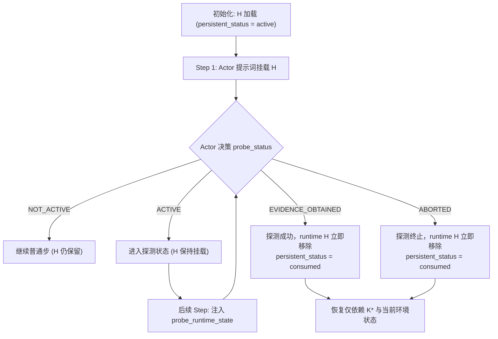

# 63. Phase 1 Fair C2 Specification: Structured Generic Exploration Baseline

> 状态：Phase 1 评测基线规范（2026-09-18）
> 分支：`exp/minimal-exploratory-memory-validation`
> 对应任务：Phase 1 Targeting-Value Readiness — Deliverable A

---

## 1. 科学问题与公平性核心原则

本轮 pre-pilot correction 另外冻结一个不依赖语义解释的共享 local probe budget：

```json
{
  "schema_version": "phase1-symmetric-local-probe-budget-v1",
  "max_probe_actions": 4,
  "max_distinct_candidate_visits": 2
}
```

该 contract 同时进入 C2/C3 immutable run config；计数只来自真实执行的 action 和
`probe_runtime_state`，不决定模型下一步选什么，也不提供 rule-based planner。C2/C3
必须使用同一 `probe_budget_sha256`。

在 Phase 1 中，本研究的核心科学检验是：

$$
\boxed{C3 \text{ (History-derived Targeted Exploration)} \quad \text{vs.} \quad C2 \text{ (Fair Structured Generic Exploration)}}
$$

辅以 $C1 \text{ (Retrospective Established Memory Only)}$ 作为基础对照条件。

### 1.1 为什么必须严格规范 C2？

在以往探索性智能体研究中，最常见的评估缺陷是**稻草人基线（Strawman Baseline）**：
- 为自身方法（$C3$）配备结构化的探测策略（Probe Policy）、明确的证据终止条件（Stop Conditions）、单次执行授权（One-shot Authority）以及机械运行状态追踪（`probe_runtime_state`）；
- 却给基线（$C2$）只提供一段模糊的自然语言提示（如 *"Please explore alternative strategies"* 或 *"Try different things"*）。

如果在此种对比下 $C3 > C2$，结论是**严重混淆且不可信**的：研究者无法区分性能优势究竟来自“**历史归纳的针对性探索假设（History-derived Targeting Information）**”，还是仅仅来自“**拥有了结构化探测接口、停止条件和明确指令权限**”。

反之，若为了“增强” $C2$ 而允许其在目标任务开始时获取任何未在公开初始状态中体现的信息（如预知目标物品在何处、或看到目标专属的 Oracle 替代路径），则构成了向基线泄漏评估者真值（Evaluator/Oracle Leakage），使得对比丧失因果解释力。

因此，**公平 C2（Fair C2）的核心定义原则**为：
1. **接口与载体完全对称**：$C2$ 的探索性记忆对象（Exploratory Memory Object）在 JSON Schema、字段层级、运行时生命周期、提示词呈现位置、提示词结构形式上与 $C3$ 完全相同；
2. **权威与执行机制完全对称**：$C2$ 同样享有单次执行授权（One-shot Authority），在目标任务中一旦被激活（`ACTIVE`），其运行时提示保留直到模型报告 `EVIDENCE_OBTAINED` 或 `ABORTED`；持久化生命周期同样从 `active` 转为 `consumed`；
3. **状态机与机械簿记完全对称**：$C2$ 的执行过程由环境与线下的 `probe_runtime_state` 机械记录探测步数、导航步数与访问位置，不增加也不减少任何机械元数据；
4. **上下文与 Token 预算大致对称**：$C2$ 和 $C3$ 使用同一 actor prompt surface、相同 step cap 和相同 H schema；pilot 启动前记录两者实际 token 分布。当前 runner 不伪装成已经完成了固定的 10% 长度保证；若长度明显失衡，必须在 paid run 前冻结修订或报告该混杂；
5. **唯一科学差异：严格剔除历史归纳针对性信息（History-derived Targeting Information）**：
   - $C3$ 的假设由模块 B 诊断历史经验中的未决比较（Unresolved Incumbent Comparison），并由模块 C 合成针对特定局部功能（如“表面优先于柜内”）的探测策略；
   - $C2$ 的假设是**结构化泛化探索（Structured Generic Exploration）**，即指示智能体在承诺执行既定惯性路径之前，系统化地探测与既有路径不同的局部替代选项，但不包含任何“此前某任务在柜子寻找中受挫”的历史诊断，也不特异性地指定“去台面找”这一由历史推导出的特定替代方案；
   - Phase 1 的 C2a 使用一次冻结的、任务族级的 generic H artifact。它不读取 B/C 输出、source trajectory、source grounding、target registry 的 hidden fields 或任何 target outcome；C1/C2/C3 只在 actor prompt 中改变是否挂载这个 H，以及 C2/C3 的 H 内容；
6. **严禁包含目标隐藏真值或评估者信息**：$C2$ 不得读取目标环境的真实物品位置、PDDL 隐藏事实、Oracle 演示序列或评估者标签。

Actor backbone、temperature、thinking、step cap 和 actor prompt version 不由 C2/C3
各自配置决定，而由 committed `phase1_actor_manifest.json` 冻结；C1/C2/C3 之间只允许
H intervention 不同。当前 manifest 的 Qwen3.8-Flash 仍是待独立 reliability gate 的
planning candidate，不是已经通过 gate 的科学结论。

---

## 2. C2 的两种变体与 Phase 1 选型

在正式实验设计中，存在两种逻辑上自洽的泛化/替代探索基线：

### 2.1 C2a：离线固定的结构化泛化探索策略（Structured Generic Exploration Policy，推荐主条件）

- **定义**：在进入目标任务之前，根据公开的任务族类别（Task Family，如物体搜寻与摆放）生成一份静态、结构化的探索记忆对象。
- **内容特征**：包含完整的 `probe_policy` 结构（目标、适应性策略、终止条件、证据目标等），但策略内容是泛化的结构化探索准则（例如：在承诺既有搜索顺序前，先就近检查视野内未访问的候选位置，并在发现目标或达到局部上限时终止）。
- **优势**：
  - 与 $C3$ 完全同构，同属“离线生成、在线轻量挂载（Heavy Offline, Light Online）”架构；
  - 在线执行零额外推理开销（Zero Extra Online Synthesis Latency/Cost）；
  - 变量控制最为纯粹：直接隔离“针对性假设（Targeted Hypothesis）”与“泛化探索框架（Generic Exploration Framework）”。

### 2.2 C2b：目标时按需局部探索合成（Target-time On-demand Exploration Synthesis，记录为未来消融基线）

- **定义**：在目标任务到达、获得公开初始观察后，在线调用大模型根据当前观察现场合成一份针对当前环境的局部替代探测策略。
- **回答的科学问题**：*“为什么非要把历史未决比较持久化成记忆，而不是未来任务到达时现场想一个探索策略？”*
- **Phase 1 定位**：
  - $C2b$ 是强基线，但它引入了**在线生成大模型调用（Online LLM Call）**，改变了在线延迟与计算架构，同时可能在现场合成中混入特定模型的在线零样本规划能力，增加混杂变量；
  - 根据 `docs/current_state/07_experiment_validation_roadmap.md` 与 `docs/62_phase1_targeting_pilot_coding_agent_prompt.md` 的明确规定：**Phase 1 pilot 优先冻结 C1 vs C2a vs C3；C2b 不作为 Phase 1 pilot 的必选执行条件，但在设计文档中予以严格规范，留待后续深入消融。**

因此，**Phase 1 中所有标记为 C2 的实验条件，均指代严格规范的 C2a（Structured Generic Exploration）**。

---

## 3. C2 探索性记忆对象（Exploratory Memory Object）完整 Schema 与规范

$C2$ 的探索记忆对象必须能够无缝通过现有的 `validate_c_result` / `future_exploratory_memory` 接口或其等价的泛化校验器。

### 3.1 字段级对比表

| 字段 | C3（History-derived Targeted） | C2（Fair Structured Generic） | 说明与公平控制 |
|---|---|---|---|
| `type` | `"exploratory"` | `"exploratory"` | 完全一致，告知 Actor 处于探索性记忆范式 |
| `scope` | 匹配特定比较的上下文（如：*“任务中目标物品隐藏，且同时存在柜子与台面等混合存储”*） | 任务族级公开范围（如：*“任务中目标物品未直接可见，存在多个可选候选容器”*） | $C2$ 范围基于公开任务特征，不引用历史特定冲突 |
| `hypothesis` | 针对特定替代策略的对比假设（如：*“优先搜寻开敞台面比搜寻闭合橱柜具有更少的操作步数”*） | 泛化探索收益假设（如：*“在承诺既有固定顺序前，系统化试探视野内临近的未访问替代容器，可能发现比默认惯性更短的路径”*） | $C3$ 假设来自历史 B 诊断；$C2$ 假设为探索的一般性收益 |
| `guidance` | 具体指引：*“先前往台面等开敞表面检查，未果后再开启橱柜”* | 泛化指引：*“先探查 1-2 个与既有流程不同的未访问候选位置，观察目标是否可达；若发现则获取，若未见则切回既有常规流程”* | 结构、语气、动作动词完全对等，但 $C2$ 不指定具体哪种容器（如台面） |
| `probe_policy.local_function` | *“选择隐藏物体搜索阶段的首选探查容器类型”* | *“在承诺默认搜索流程前试探可行的备选容器”* | 针对同一个局部决策点（Functional Contract） |
| `probe_policy.realization_pattern` | *“Surface-First Search: 优先开敞表面，后闭合容器”* | *“Alternate Candidate Probing: 优先探测未承诺的临近候选，再切回默认”* | 均为局部探测模式 |
| `probe_policy.capability_requirements` | `["Navigation", "Surface Inspection", "Cabinet Opening"]` | `["Navigation", "Receptacle Inspection", "Fallback to Default"]` | 均要求基础导航与检查动作 |
| `probe_policy.adaptive_policy` | 详述按台面顺序遍历，未果则切回橱柜 | 详述选择未访问候选位置，确认无果后终止并切回默认 | 步骤逻辑、条件判断完全对等 |
| `probe_policy.evidence_goal` | *“记录表面搜索获取物体的步数，并与橱柜基线对比”* | *“观察备选容器中是否存在目标，记录是否可避免深层默认搜索”* | 均为比较性证据目标 |
| `probe_policy.stop_conditions` | 1. 发现并获取目标<br>2. 台面耗尽<br>3. 步数上限 | 1. 发现并获取目标<br>2. 备选试探耗尽<br>3. 局部探测步数上限 | 具有完全相同的终止触发结构 |
| `probe_policy.required_downstream_state` | *“Agent 手持目标物品，准备执行后续清洗/放置”* | *“Agent 手持目标物品，准备执行后续清洗/放置”* | 完全一致，严格保护下游 Functional Contract |

### 3.2 C2 探索性记忆的标准 JSON 实例（以物体寻找任务族为例）

```json
{
  "type": "exploratory",
  "scope": "ALFWorld tasks where the target object is not visible in the initial observation and multiple admissible candidate receptacles exist.",
  "hypothesis": "Probing accessible unvisited candidate receptacles differing from the incumbent fixed order before committing to the default sequence can locate the required object in fewer actions.",
  "guidance": "Before following the established sequence, probe available unvisited receptacles in the immediate area. Check whether the target object is present. If found, acquire it and proceed. If the local probe does not reveal the object, abort the probe and resume the established routine.",
  "probe_policy": {
    "local_function": "Probing alternative candidate receptacles prior to committing to the default search sequence.",
    "realization_pattern": "Alternate Candidate Probing: Systematically test alternative unvisited visible receptacles before executing the fixed incumbent path.",
    "capability_requirements": [
      "Navigation to visible receptacles",
      "Receptacle inspection (opening or surface viewing)",
      "Fallback to established sequence upon negative result"
    ],
    "adaptive_policy": "1. Identify visible unvisited receptacles differing from the incumbent's next target. 2. Navigate to and inspect the first candidate. 3. If target object is observed, take it and declare evidence obtained. 4. If not found and alternative limit reached, abort probe and revert to established memory routine.",
    "evidence_goal": "Determine whether an alternate nearby candidate yields the required object faster than the incumbent sequence without violating task constraints.",
    "stop_conditions": [
      "Target object is found and acquired.",
      "All alternate local candidates have been inspected without finding the object.",
      "Local exploration step cap reached."
    ],
    "required_downstream_state": "Agent carrying the target object, ready to continue downstream processing and destination placement."
  }
}
```

---

## 4. 运行时的生命周期与权威控制对称性

为了保证在 Actor 决策循环中的严格对齐，$C2$ 与 $C3$ 遵循**完全相同的运行时控制逻辑**：



1. **单次使用授权（One-shot Authority）**：
   - 无论 $C2$ 还是 $C3$，智能体在整个 Episode 中只被允许执行一次该探索过程；
   - 首次报告 `EVIDENCE_OBTAINED` 或 `ABORTED` 后，运行时探索记忆立即从 Actor 提示词中解除（`runtime_memory = None`），后续步骤退回为纯既定记忆（$C1$ 状态）；
   - 持久化状态由 `active` 转为 `consumed`。
2. **Actor 接口无差别**：
   - 模型输出 Schema 严格固定为 `{"action_index": int, "probe_status": str}`；
   - 模型面临的动作选项列表严格为当前状态的有序 `admissible_actions`；
   - 零修改 Actor 提示词模板中关于 `action_index` 与 `probe_status` 的使用说明。
3. **机械状态追踪（Mechanical `probe_runtime_state`）**：
   - $C2$ 运行过程中，系统机械地向模型反馈当前的探测进度事实：
     ```json
     {
       "probe_active": true,
       "probe_step_count": 2,
       "probe_navigation_steps": 2,
       "visited_receptacles_under_probe": ["countertop_1", "sinkbasin_1"],
       "current_probe_status": "ACTIVE"
     }
     ```
   - 绝不引入任何语义打分、奖励塑形或外部启发式评价。

---

## 5. C1 / C2 / C3 对照实验矩阵定义

在 Phase 1 的 Frozen-history 实验设计中，三组条件的控制变量严格划定如下：

| 条件标识 | 既定记忆（$K^*$） | 探索记忆（$H$） | 历史针对性依据 | 目标时计算开销 | 测量的核心效应 |
|---|---|---|---|---|---|
| **C1** (Established Only) | $\checkmark$ 相同 $K^*$ | $\times$ 无（`None`） | 无 | 基础 Actor 调用 | 既有可行经验的基线性能与惯性路径长度 |
| **C2** (Fair Structured Generic) | $\checkmark$ 相同 $K^*$ | $\checkmark$ 泛化结构化 $H_{gen}$ | 无（仅任务族通用准则） | 基础 Actor 调用 + 轻量 $H$ 上下文 | **泛化探索机制与结构化授权本身**带来的收益/扰动 |
| **C3** (Targeted Exploratory) | $\checkmark$ 相同 $K^*$ | $\checkmark$ 历史推导针对性 $H_{tgt}$ | $\checkmark$ 来自源任务 B/C 的未决比较 | 基础 Actor 调用 + 轻量 $H$ 上下文 | **历史推导的针对性假设（Targeting Value）**的净增量收益 |

### 核心因果归因方程

若定义某性能/成本指标为 $M$（如成功率、环境总步数、Token 开销），则有：
1. **探索机制效应（Exploration Mechanism Effect）**：
   $$\Delta_{mech} = M(C2) - M(C1)$$
   反映仅仅允许并结构化指导智能体进行局部探索，是否能够打破惯性路径，还是引入了无意义的动作冗余。
2. **针对性信息净价值（Net Targeting Value，核心贡献）**：
   $$\Delta_{targeting} = M(C3) - M(C2)$$
   反映**源自过往未决比较的历史洞见**是否比普通的泛化试探更有效率、更高概率地发现高价值替代路径。

---

## 6. 验证与反向防范检查清单（Anti-Cheat Checklist）

任何生成的 C2 规范与实例必须通过以下断言检查：

- [x] **无历史诊断词汇**：$C2$ 的内容中严禁出现任何具体的源任务 ID（如 `alfworld-p-005`）、源任务失败日志或源任务未决诊断描述；
- [x] **无评估者/真值泄漏**：$C2$ 的内容中严禁包含当前测试任务的目标实体具体编号（如 `apple_1`）、目标隐藏位置（如 `fridge_1`）或 Oracle 动作步骤；
- [x] **Schema 兼容性**：$C2$ 必须具备合法的 `type`, `scope`, `hypothesis`, `guidance`, `probe_policy` 结构，且 `probe_policy` 必须包含全部 7 个必需字段；
- [ ] **Token 长度审计**：启动 paid pilot 前比较 C2/C3 实际 actor-input token 分布；不能仅用字符数替代 token 审计，也不能在结果出来后删掉长度异常样本；
- [x] **单次生命周期**：$C2$ 必须在首次达到 `EVIDENCE_OBTAINED` 或 `ABORTED` 后自动退出运行时提示，不得持续常驻。
