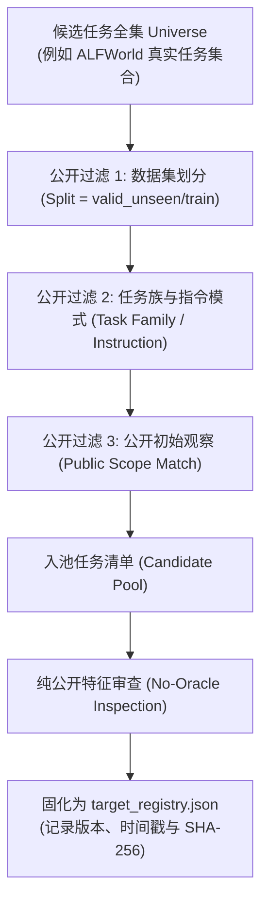

# 65. Phase 1 Public-Only Target-Pool Sampling & Registry Protocol

> 状态：Phase 1 目标池采样与注册规范（2026-09-19，pre-pilot correction）
> 分支：`exp/minimal-exploratory-memory-validation`
> 对应任务：Phase 1 Targeting-Value Readiness — Deliverable C

---

## 1. 目标选择的硬性科研红线：前置注册与纯公开特征

本轮修正废止了此前只保存 25 个候选 ID 的手工 candidate universe。当前实现先枚举
pinned ALFWorld `train` split 的全部 task/trial 目录，再对每个 reset 只保存 actor-visible
public state，最后执行确定性的 partition。完整实现见：

```text
experiments/exploratory_memory_mvp/phase1_population.py
experiments/exploratory_memory_mvp/build_phase1_registry.py
experiments/exploratory_memory_mvp/cases/phase1_source_tasks.json
experiments/exploratory_memory_mvp/cases/phase1_registered_targets.json
```

当前 frozen artifact 包含 54 个 eligible public records，而不是只包含最终 20 个 target。

在因果评估（Causal Evaluation）中，最为致命的隐性作弊是**结果驱动的样本挑选（Outcome-Driven Target Selection）**：
- 研究者事先知道目标的隐藏真实状态（例如通过查看环境内部 PDDL 知道苹果实际上在台面上）；
- 挑选“已知假设 $H$ 必然能成功缩短路径”的目标任务进入实验组；
- 或者在运行后剔除那些“因探索而走弯路或失败”的困难样本。

这种做法破坏了统计推断基础，把“探索假设是否具有鲁棒价值”偷换成了“研究者是否能挑出顺从案例”。

为了根除这一偏差，Phase 1 确立以下**两项不可动摇的红线原则**：

1. **事前锁定与静态注册（Pre-Outcome Registration）**：
   - 目标任务池（Target Pool）必须在**任何模型调用、任何条件执行、任何隐藏状态揭露之前**完成预选与注册；
   - 注册清单一旦生成，立即计算哈希并固化在版本控制中，实验运行必须严格按注册清单顺序遍历，严禁事后增删。
2. **纯公开结构谓词（Public-Only Structural Predicates）**：
   - 决定一个候选任务能否进入目标池的准入条件，必须**且仅能**由智能体在任务起始时能够合法获知的**公开事实（Public Facts）**构成；
   - **严禁使用任何隐藏真值、环境 Oracle 或事后结果作为入池条件**。

---

## 2. 准入谓词与禁止谓词清单

### 2.1 允许使用的公开结构谓词（Allowed Public Predicates）

| 谓词类别 | 允许的判定维度 | 提取依据（智能体公开可见） |
|---|---|---|
| **数据集划分（Split）** | `valid_unseen` 或 `train` | 官方公开 Benchmark 分区元数据 |
| **任务族（Task Family）** | 如 `pick_clean_then_place_in_recep`、`pick_and_place_simple` 等 | 任务公开类型标识符 |
| **公开指令模式（Public Instruction）** | 目标物品类型（如 `Apple`）、目标容器（如 `Microwave`） | 初始自然语言指令文本字符串正则匹配 |
| **初始公开观察（Initial Observation）** | 房间类型（Kitchen/Bathroom）、视野内可见的初始容器列表 | 智能体 Step 0 接收到的第一句文本观察 |
| **可用合法交互集（Action Set）** | 初始 `admissible_actions`（如包含 `go to countertop_1` 等） | 环境在 Step 0 公开返回的可选动作索引列表 |
| **探测范围逻辑匹配（Public Scope Match）** | $H$ 所声明的公开适用条件（如“目标物品未在初始视野内直接呈现，且存在多个可选容器”） | 初始文本与合法动作的公开逻辑布尔判断 |

### 2.2 严格禁止使用的私有与事后信息（Strictly Forbidden Predicates）

| 禁止信息类别 | 违规示例 | 为什么严格禁止 |
|---|---|---|
| **目标隐藏真实位置（Hidden Location）** | *“挑选苹果实际上在台面上的任务”* | 违背未知探索前提；直接注入未来 Oracle |
| **专家演示/最佳路径（Oracle Actions）** | *“挑选最优路径需要检查台面的任务”* | 依赖环境内部 PDDL 规划器求解 |
| **预运行评测结果（Outcome-dependent）** | *“只保留 C3 能够获胜或步数更短的任务”* | 严重选择性偏差（Selection Bias） |
| **研究者主观偏好（Subjective Cherry-picking）** | *“我觉得这个任务看起来很适合探索”* | 破坏科学可重复性 |

---

## 3. 目标池采样与注册流程



### 3.1 目标池的分布多样性要求

自然入池的目标任务集合，必然且应当包含以下四种现实情况：

1. **正向有益样本（Helpful / Positive Evidence）**：
   - 探测策略探索的位置恰好存在目标物品，智能体大幅减少了原本深层遍历的冗余步数；
2. **中性无害样本（Neutral / Graceful Fallback）**：
   - 探测策略探索的位置没有目标物品，但智能体在步数上限内及时报告 `ABORTED`，优雅切回既有记忆完成任务；
3. **负向扰动样本（Negative / Cost Overhead）**：
   - 探测策略探索的位置不仅没有目标物品，且耗费了额外步数与 Token，导致最终步数略长于惯性基线 $C1$；
4. **模型能力失效样本（Actor Failure / Step Cap）**：
   - 基础模型在执行下游任务时产生语义循环或超时，展示真实测试分布下的模型脆弱性。

> [!NOTE]
> 只有完整保留这四类样本的自然分布，Phase 1 得出的 $C3$ vs. $C2$ 差异才具备统计真实性与审稿可信度。

---

## 4. 注册表文件规范与 Schema

下面的 JSON 只用于说明字段语义；`records`、`partitions` 和 `targets` 在实际冻结文件中
是完整列表，不能把这个缩略示例直接当作 registry 输入。可加载的 schema 由
`target_registry.py` 的 validator 强制执行。

目标注册表保存为标准的 JSON 格式，存放于版本控制路径中：

```json
{
  "schema_version": "phase1-public-universe-partition-v2",
  "registry_id": "phase1a_alfworld_public_universe_v2",
  "carrier": "alfworld_text",
  "split": "train",
  "created_at": "2026-09-19T00:00:00Z",
  "candidate_universe": {
    "source": "pinned ALFWorld train task IDs enumerated before outcomes",
    "candidate_ids": ["..."],
    "candidate_count": 54,
    "candidate_ids_sha256": "6f12d1a1e26a9a5d5b95567a1b0900d08cce8b39d745939a8332b39b35cdb283",
    "records": "完整的 54 条 public-only record",
    "records_sha256": "f0c2157f2a78bccc2a36750b696866c6f87a2fb570a3a6bc89f7bb5cc438ecf3"
  },
  "inclusion_criteria": {
    "public_task_families": [
      "pick_and_place_simple",
      "pick_clean_then_place_in_recep",
      "pick_heat_then_place_in_recep",
      "pick_cool_then_place_in_recep"
    ],
    "object_initially_hidden": true,
    "mixed_receptacles_visible": true,
    "public_only": true,
    "outcome_blind": true,
    "hidden_outcome_free": true,
    "scope_match_rule": "public task family and initial public affordance structure only"
  },
  "exclusion_reasons": [
    {
      "target_id": "pick_and_place_simple-AlarmClock-None-Desk-314/trial_T20190908_185938_027368",
      "reason": "reserved as a source task for the frozen H family; excluded before target outcomes"
    }
  ],
  "human_review": {
    "performed": false,
    "mode": "mechanical_public_only",
    "note": "No outcome-based semantic review was used for inclusion."
  },
  "targets": [
    {
      "target_id": "pick_clean_then_place_in_recep-Apple-None-Microwave-14/trial_T20190909_120203_117379",
      "task_family": "pick_clean_then_place_in_recep",
      "requested_seed": 42,
      "public_instruction": "put a clean apple in microwave.",
      "public_initial_fingerprint": "60064b175a17a77e4c02b79a2bebc2b8070af7401969d6c816448961032fc8c0",
      "matched_h_family": "h_family_receptacle_search",
      "status": "registered"
    }
  ]
}
```

### 4.1 字段约束说明
- `target_id`: 宿主环境的标准任务唯一标识路径；
- `task_family`: 公开任务族名；
- `requested_seed`: 严格固定的运行随机种子；
- `public_instruction`: 智能体初始接收到的公开任务描述；
- `public_initial_fingerprint`: 由初始观察与有序合法动作通过规范哈希生成的纯公开状态指纹；
- `matched_h_family`: 所匹配的探索记忆族标识符；
- **严禁字段**：`oracle_location`、`true_object_receptacle`、`expected_winner` 等严禁出现。

`candidate_universe.records` 只包含 `task_family`、公开 instruction、初始公开 observation、
有序 `admissible_actions`、公开 affordance structure 和 public fingerprint。它不包含
static PDDL、placement、专家轨迹或任何条件结果。`partitions` 通过固定 salt
`phase1a-public-universe-partition-v1` 以及 public task family 分层 + SHA-256 排序生成：

```text
Source                 5   （固定 source reservation）
Hard calibration      10   （Phase 1A in-domain C1 actor gate）
Diagnostic calibration 18  （out-of-domain stress only; never admission）
Target                20   （Phase 1A target scope）
Residual               1   （public hash quota 外的 eligible candidates）
```

五个集合两两不交并覆盖完整 54 条 universe。hard calibration 只包含
`pick_and_place_simple`、`pick_clean_then_place_in_recep`、
`pick_cool_then_place_in_recep`、`pick_heat_then_place_in_recep`。当前 digests：

```text
candidate IDs:  6f12d1a1e26a9a5d5b95567a1b0900d08cce8b39d745939a8332b39b35cdb283
public records: f0c2157f2a78bccc2a36750b696866c6f87a2fb570a3a6bc89f7bb5cc438ecf3
partitions:     fc548e0f4f493074ed2bc20b05433b6d7a94602e8c77a694cc745030037b120f
registry:       0e43d9846ad96249ef1b421b02585a0fff1190e76eb6156b64e64da6c805588d
applicability:  71d982a25ab3d9b7da40b71e1f3900e39fcd0f59ddd40e551b040c38d4499d82
```

`public_initial_fingerprint` 只由 reset 后 actor 可见的 observation、有序 admissible
actions 和 `won` 组成；它不是 static PDDL/hash，也不暴露隐藏 placement。Runner 在实际
episode 创建后重新计算该 fingerprint，并把它与 frozen registry 比较，失败即停止。

---

## 5. 校验与防作弊检查清单（Anti-Leakage Audit Checklist）

- [x] **字段隔离校验**：调用 `assert_no_evaluator_keys()` 确保注册表中无任何 `evaluator_notes` 或 `oracle_*` 字段；
- [x] **纯公开特征入池**：registry 只固化 task identity、public instruction、reset 后 public fingerprint 和 action affordance 结构；绝不读取 `game.tw-pddl` 中的 placement 事实作为 inclusion predicate；
- [x] **注册表哈希固化**：计算目标注册表的整体 SHA-256 并在实验运行配置中强校验；
- [x] **不跳步执行**：实验运行器（Runner）必须完全按照注册表中的条目逐一执行，不得根据中间结果跳过任何注册任务。
